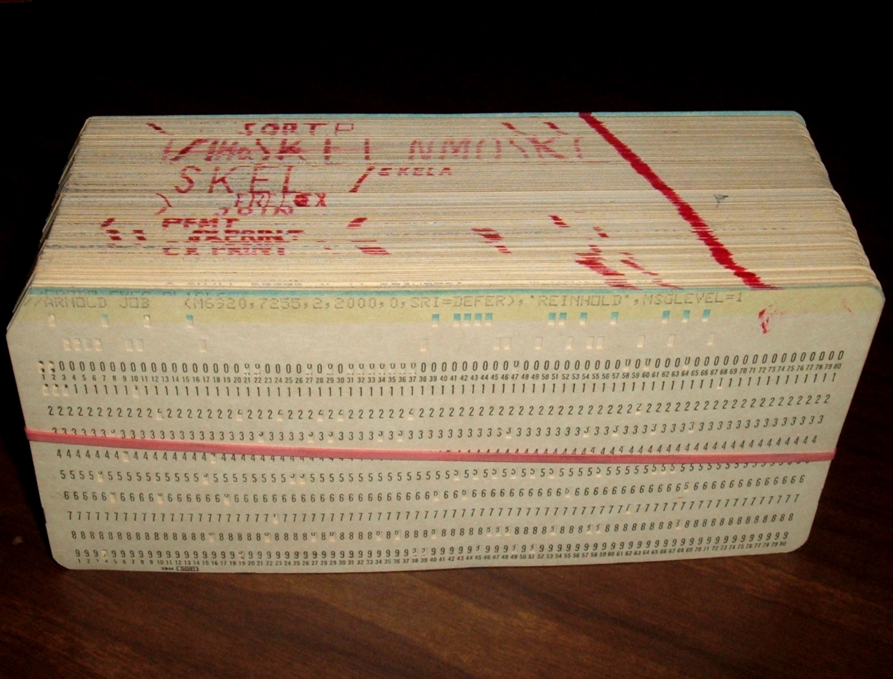

{/* _class: impact */}

# The cursor, made visible

Week 7 — the pattern engine begins

```notes
This is the centrepiece lecture of the whole course. Movements I and II
were scaffolding to get here honestly. Slow down more than usual.
```

---

## A pattern is a value

Not syntax. A value — of its own distinct type, on equal footing with an
integer or a string.

Built once. Stored in a variable. Passed to a function. Matched against
many subjects over its lifetime.

---

## Built from exactly two operators

- **concatenation** — plain juxtaposition, same as week 4's strings
- **alternation** — `|`

Closed under both. Gimpel (1973) shows both are associative, and that
concatenation distributes over alternation from the right.

```notes
Gimpel's algebraic treatment: a pattern really is one kind of composable
object, not a grab-bag of special cases held together by convention.
```

---

## What closure buys you

Build a small library of named patterns once —

`WORD`, `NUMBER`, `WHITESPACE`

— and combine them into a larger pattern without writing a single new
primitive matching procedure.

---

{/* _class: banner */}

## The cursor model

---

## Two things a match happens over

**Subject**: a string. Never modified by a match attempt.

**Cursor**: an integer sitting *between* characters — position 0 is
before the first character, position `n` is after the last.

---

## Griswold's three conditions

Any correct matching procedure must:

1. not change the value of the subject
2. leave the cursor between where it started and the end of the
   subject — never backward, within one successful step
3. on failure, leave the cursor exactly where it found it

```notes
This is a genuinely minimal spec. It says nothing about HOW a matching
procedure is implemented — only what it must preserve on success or
failure. That distinction matters for the last third of this lecture.
```

---

## Every primitive obeys exactly these three rules

A literal. `ANY`. `BREAK`. `ARB`. Everything weeks 8 and 9 add.

Nothing more, nothing less.

---

{/* _class: impact */}

## Backtracking retries. It does not commit.

---

## `'--1B-A-' (ANY('AB') | '1' ABORT)`

What do you expect?

```notes
Give them a beat here before advancing. Most people's intuition says
"it scans ahead, finds the B, succeeds there." That's not what happens.
```

---

## What actually happens

All alternatives of `|` are tried **at the current cursor position**
before the cursor is ever allowed to advance.

Only once every alternative fails at a position does the cursor move
forward — and the whole set gets tried again.

---

## Tracing it

At cursor 0: `-`. Neither alternative matches. Cursor advances.

...repeats until cursor reaches `1`.

At `1`: the **second** alternative matches — and hits `ABORT`.

**The match fails outright.** The matcher never reaches the `B`.

---

{/* _class: quote */}

> `|` is not an `if`/`else if` chain. It doesn't commit to whichever
> branch works first at a position — it retries. Only `FENCE` or
> `ABORT` makes a choice actually final.

---

## Unlearning the habit

The fastest way: trace it by hand, or watch an instrumented matcher
print every cursor position it visits.

`ANY('AB')` does not scan ahead. It has no memory of what's further
along the string.

---

{/* _class: banner */}

## Two ways to backtrack — both legitimate

---

## The real SNOBOL4 runtime: an explicit stack



SIL v3.11's pattern matcher (`SCNR`/`SCIN`) walks a compiled chain of
pattern nodes.

Untried alternative → push (alternative, cursor) onto the
**Pattern-Matching History List**.

Failure → `SALF`/`SALT` pop and resume from exactly there.

```notes
Not an isolated choice — the same discipline shows up in the storage
manager's GC mark phase. Explicit push/pop, not the host assembler's
call/return, wherever backtracking-shaped control flow is needed.

Background photo: an IBM System/360 program deck, circa 1969. ArnoldReinhold,
CC BY-SA 3.0, via Wikimedia Commons.
```

---

## The same design, decades later, independently

GNAT's `GNAT.Spitbol.Patterns` Ada library: a chain of pattern nodes with
a successor pointer, and an explicit stack of (cursor, node) pairs.

Two implementations, decades apart, different languages — same shape.
Not an accident of 1970s assembly conventions.

---

## OCaml hands you exactly that stack

"Try the next alternative" → an ordinary recursive call.

"Give up and backtrack" → a return from that call.

The OCaml runtime's call stack does the bookkeeping SIL's
`PDLPTR`/`PDLHED` history list does by hand.

---

## Not a lesser version

Griswold's three-condition contract places no requirement on **how**
backtracking is implemented — only on what a procedure preserves.

Either strategy satisfies it. Either can also violate it, if built
carelessly.

---

## What the hand-maintained version costs

Profiling the real 1981 IBM/360 build: procedure call/return bookkeeping
and eight-byte descriptor moves together account for **very roughly
half** of all measured execution time.

Building your own stack discipline by hand is not free just because you
control it directly.

```notes
This number gets its full citation and context in week 12 — flag it now,
don't derive it yet.
```

---

{/* _class: impact */}

## This week's studio

Build the search using an explicit stack **at least once** — deliberately —
before choosing whether to keep using it.

Literal, concatenation, alternation as pattern values. A working
backtracking search. Everything weeks 8 and 9 add rides on this without
changing it.

```notes
Further reading on the lecture page: Gimpel 1973, Griswold 1981 (Models
of String Pattern Matching, and S4D58), the Vanilla SNOBOL4 manual, and
the GNAT.Spitbol.Patterns source.
```
