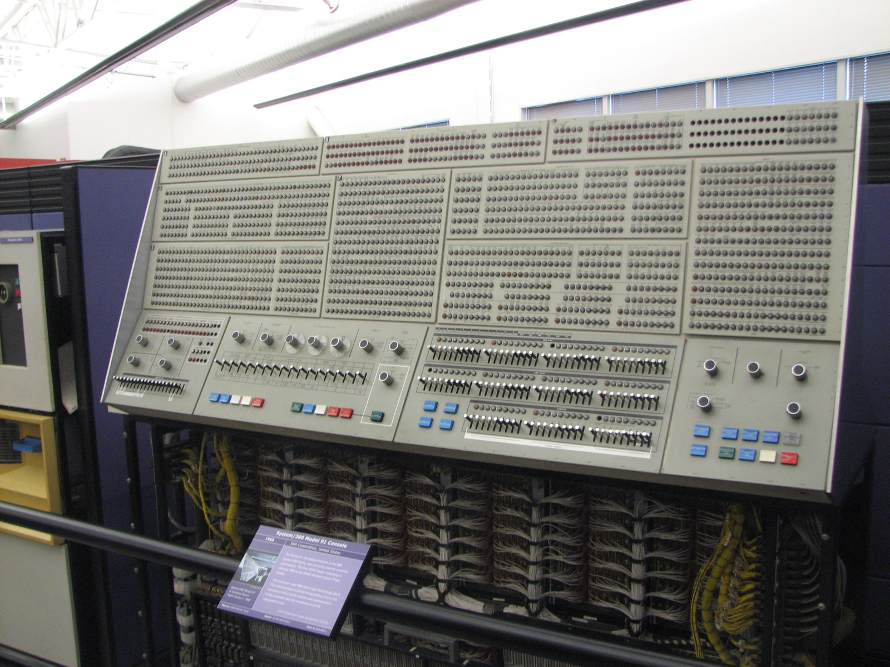

{/* _class: impact */}

# Where your interpreter's time actually goes

Week 12 — retrospective and extension

```notes
Last lecture. Two jobs: the real profiling data, and framing the final
project's four-option menu honestly — none is worth more than another.
```

---

## Before guessing, look at a real measurement

"Probably parsing." "Probably the pattern matcher."

It's tempting to guess. Resist it once — a real measurement exists, and
it does not confirm the obvious guess.

---

## S4D58: the University of Arizona's own profile



The SIL implementation of SNOBOL4, profiled function by function, 1981.

The two largest categories are **not pattern matching**.

```notes
Background photo: an IBM System/360 mainframe console. Erik Pitti, CC BY 2.0,
via Wikimedia Commons.
```

---

## Call and return bookkeeping — ~24.85%

`RCALL`, `RRTURN`, `PROC`, and the `PUSH`/`POP` operations behind them.

`RCALL` alone: **8.927%**
`RRTURN` alone: **6.182%**

---

## Descriptor move and fetch — ~24.71%

`GETD` and its relatives — the machinery that copies an 8-byte tagged
value from one place to another.

**Together: roughly half of everything measured.**

Pattern matching itself is a smaller slice than either.

---

{/* _class: quote */}

> This is real, specific, documented data — not a plausible-sounding
> number invented for this lecture.

---

## What it doesn't tell you

A 1969-vintage design, running 1981-vintage assembler, on 1981-vintage
hardware, on whatever workload the Arizona project happened to run.

Evidence that call/return and value-shuffling are **plausible** places
for time to go — not a prediction that your OCaml profile will match.

```notes
If the final project includes performance work: this is a reason to
measure your own interpreter before optimizing it, not a substitute
for measuring it.
```

---

{/* _class: banner */}

## Regeneration: SIL's name for garbage collection

---

## Not bolted on afterward

A mark-and-compact collector, driven by an explicit stack rather than
the call stack.

`GCREQ` to request a collection. `GCGOT` to record what it reclaimed.
Built into the runtime.

---

## Why the name is worth keeping

"Regeneration" describes what the collector does **to the heap** —
compacting live descriptors back into a dense region.

"Garbage collection" describes only the other direction: what it
removes.

```notes
A programmer-defined DATA type — a NODE holding references to other
NODEs — is exactly the graph a mark-and-compact collector has to walk,
not a flat value it can copy byte-for-byte.
```

---

## Did checkpoints 1–3 need this? No.

A `let`-bound OCaml value doesn't need a hand-written collector — OCaml
already has one.

It becomes live only if your final project's value type manages its own
memory outside what OCaml gives you for free.

---

{/* _class: impact */}

## The final project: four options, no ranking

Checkpoint 3's own working engine, handed back to you. What do you
extend it into?

---

## Option 1 — Pattern-matching completeness

`BREAKX`: behaves like `BREAK(s)`, but can extend itself past the break
character on a rematch.

Exactly equivalent to `BREAK(s) ARBNO(LEN(1) BREAK(s))`, composed from
primitives you already have.

---

## Option 2 — A quickscan-style heuristic

Week 9 covered quickscan and fullscan as optimizations over exhaustive
backtracking search.

Implement one for real — with a test suite confirming identical results
to unabridged retry, on cases where the two could plausibly disagree.

---

## Option 3 — A small collector

If your extension gives the value type its own managed structures: a
simple mark-and-sweep pass over them.

Not the full "regeneration" design — that would be its own multi-week
project.

---

## Option 4 — Performance work, profiled against real numbers

Last week's differential-testing harness plus a profiler. Measure where
**your** interpreter spends its time. Optimize the largest measured
cost.

Report before-and-after numbers. Not an unmeasured claim that it helped.

---

{/* _class: quote */}

> The assessment page's marking is holistic for exactly this reason — a
> fixed weighted breakdown doesn't fit four projects this different in
> shape.

---

{/* _class: banner */}

## What twelve weeks were for

---

## A fifty-year-old language, chosen on purpose

Tagged dynamic values. Success/failure as the sole control primitive.
Patterns as data.

Ideas a more comfortable modern language would let you take for
granted.

---

## What exists now is not a toy

An interpreter that reproduces real SNOBOL4 behaviour, against a real
reference implementation, on real sample transcripts — extended by a
real design decision of your own choosing.

---

{/* _class: impact */}

## The retrospective

Say, plainly, what your extension cost you and what it taught you.

Not a victory lap. Not an apology for scope you didn't reach.

**An honest account of the thing you built.**

```notes
Full citations on the lecture page: Griswold 1981 (S4D58), Budne's
CSNOBOL4 documentation on BREAKX's SPITBOL 360 origin.
```
